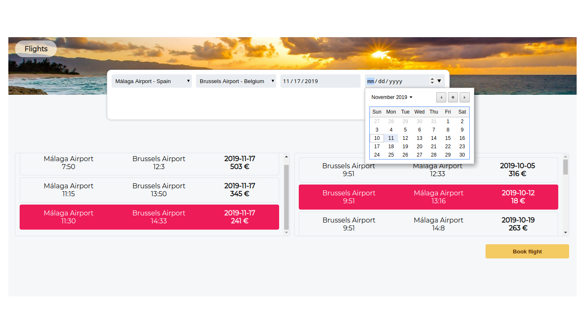

# flights
## ⚙️ How to run
Use the default PHP server to host it on your machine on a port.

This command should be executed in the same directory as this projects files.
```
php -S localhost:8787
```  
It should look like this:

<p align="center">
  
</p>
